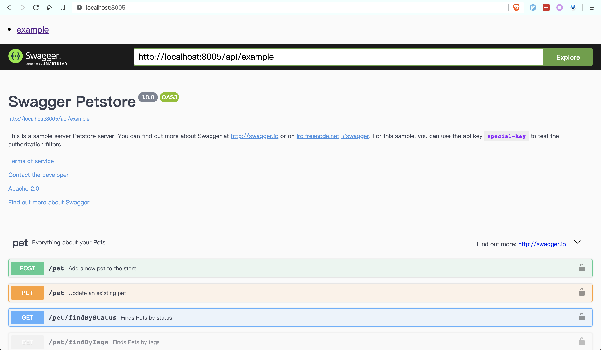

# Simple Swagger UI Server

This project displays API doc based on Swagger UI by python server.

## Dependence

Python 3 is recommended to compile this server.

These python packages are required.

1. buildout
2. tornado

## Configure environment

### buildout installation

```bash
python -m pip install zc.buildout
```

### Packages installation

Run the following command to finish packages installation.

```bash
python -m pip install requirements.txt
```

## Usage

Write your Swagger yaml document in dir `swagger`, and start server.

An example yaml file is provided for reference.

## Run server

### Project compilation

Just enter the project path and run `buildout`.

### Start server

```bash
bin/swagger-api --port=${port}
```

Default port is 8005 if no `${port}` is specified.

Then type `http://localhost:8005` in browser and swagger UI will be shown.



